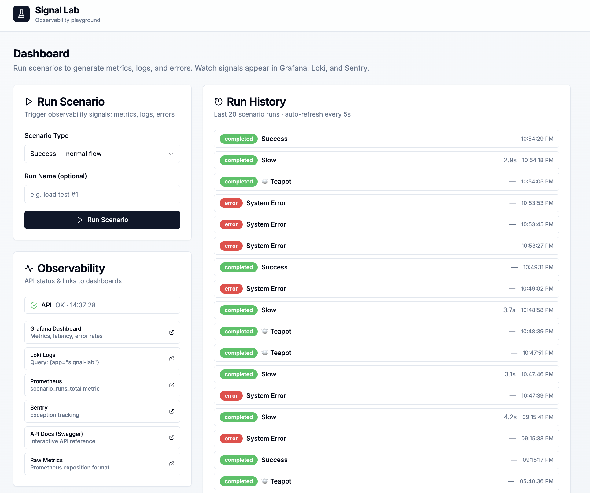
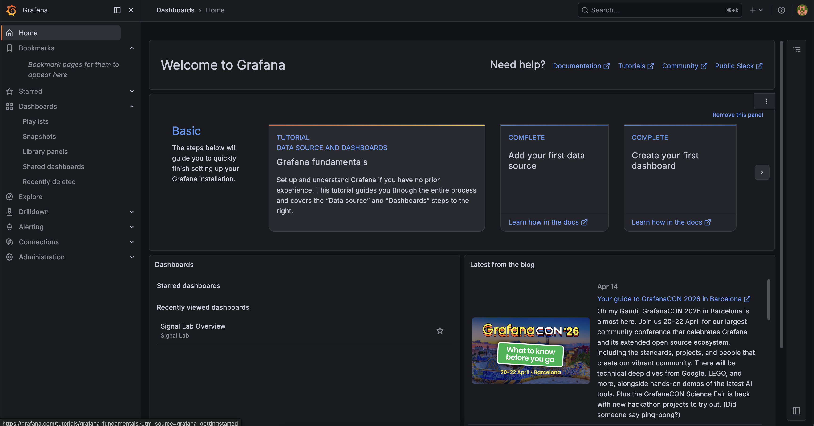
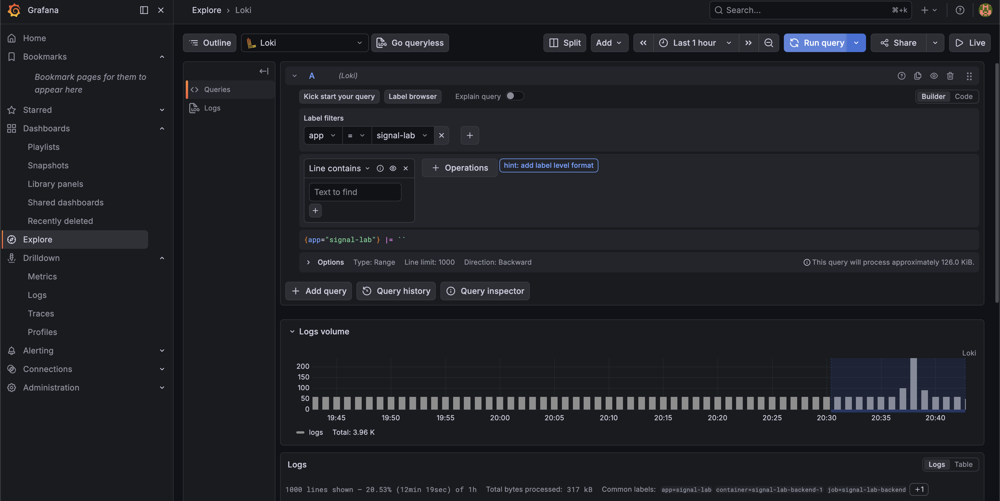
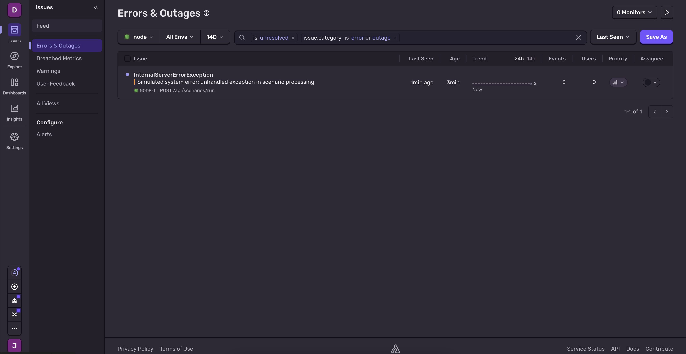

# Signal Lab — Submission Checklist

---

## Репозиторий

- **URL**: `https://github.com/<your-username>/signal-lab`
- **Ветка**: `main`
- **Время работы**: ~6 часов

---

## Запуск

```bash
# Команда запуска:
cp .env.example .env
# Опционально: добавить SENTRY_DSN в .env
docker compose up -d

# Команда проверки:
curl http://localhost:3001/api/health

# Команда остановки:
docker compose down
```

**Предусловия**: Docker Desktop 24+, Compose v2. Node.js не нужен для запуска.

---

## Стек — подтверждение использования

| Технология | Используется? | Где посмотреть |
|-----------|:------------:|----------------|
| Next.js (App Router) | ☑ | `apps/frontend/src/app/` — layout.tsx, page.tsx, providers.tsx |
| shadcn/ui | ☑ | `apps/frontend/src/components/ui/` — Button, Card, Input, Badge, Select, Toast |
| Tailwind CSS | ☑ | `apps/frontend/tailwind.config.ts`, все `className=` в компонентах |
| TanStack Query | ☑ | `RunHistory.tsx` (useQuery + refetchInterval), `ScenarioRunner.tsx` (useMutation + invalidateQueries) |
| React Hook Form | ☑ | `ScenarioRunner.tsx` — useForm + zodResolver + register + handleSubmit |
| NestJS | ☑ | `apps/backend/src/` — AppModule, ScenariosModule, MetricsModule, HealthModule |
| PostgreSQL | ☑ | `docker-compose.yml` — postgres:16-alpine, порт 5432 |
| Prisma | ☑ | `prisma/schema.prisma`, `apps/backend/src/prisma/prisma.service.ts` |
| Sentry | ☑ | `apps/backend/src/instrument.ts`, `GlobalExceptionFilter` — captureException |
| Prometheus | ☑ | `apps/backend/src/metrics/` — MetricsService, GET /api/metrics |
| Grafana | ☑ | `grafana/dashboards/signal-lab.json`, auto-provisioned при старте |
| Loki | ☑ | `loki/loki-config.yml`, `promtail/promtail-config.yml`, логи текут через Promtail |

---

## Observability Verification

| Сигнал | Как воспроизвести | Где посмотреть результат |
|--------|-------------------|------------------------|
| Prometheus metric | Нажать "Run Scenario" любого типа | `curl http://localhost:3001/api/metrics \| grep scenario_runs_total` |
| Grafana dashboard | Запустить несколько сценариев | `http://localhost:3100` → Dashboards → Signal Lab → Signal Lab Overview |
| Loki log | Запустить любой сценарий | Grafana → Explore → Loki → `{app="signal-lab"}` |
| Sentry exception | Запустить "System Error — 500" | Sentry проект → Issues (требует SENTRY_DSN в .env) |

**Easter egg**: запустить сценарий типа `teapot` — HTTP 418, `{ "signal": 42, "message": "I'm a teapot" }`, сохраняется в БД с `metadata: { easter: true }`.

---

## Cursor AI Layer

### Custom Skills

| # | Skill name | Назначение |
|---|-----------|-----------|
| 1 | `observability-skill` | Добавить метрики (counter + histogram), структурированные логи и Sentry capture к любому endpoint |
| 2 | `nestjs-endpoint-skill` | Scaffold NestJS endpoint с DTO, Service, Controller, Module — с observability из коробки |
| 3 | `shadcn-form-skill` | Форма shadcn + React Hook Form + Zod + TanStack Query mutation + toast |
| 4 | `signal-lab-orchestrator` | 7-фазный orchestrator: Analysis→Scan→Plan→Decompose→Implement→Review→Report, context.json, resume |

### Commands

| # | Command | Что делает |
|---|---------|-----------|
| 1 | `/add-endpoint` | Scaffold NestJS endpoint с DTO, сервисом, контроллером, метриками и логами — по чеклисту |
| 2 | `/check-obs` | Аудит файла на наличие observability сигналов, выводит ✓/✗ таблицу |
| 3 | `/health-check` | Проверяет все 7 сервисов стека, выводит статус каждого |

### Hooks

| # | Hook | Скрипт | Какую проблему решает |
|---|------|--------|----------------------|
| 1 | `postToolUse` → schema.prisma | `.cursor/hooks/check-schema-migration.sh` | Предотвращает забытую `prisma migrate dev` — самая частая причина runtime crash при работе с Prisma |
| 2 | `postToolUse` → controller.ts | `.cursor/hooks/check-endpoint-observability.sh` | Ловит новые контроллеры без MetricsService, Logger или Swagger — сразу при создании файла |

### Rules

| # | Rule file | Scope | Что фиксирует |
|---|----------|-------|---------------|
| 1 | `stack-constraints.mdc` | Always | Запрет Redux, SWR, TypeORM, styled-components и других off-stack библиотек |
| 2 | `observability-conventions.mdc` | `apps/backend/**` | snake_case метрики, `_total` suffix, обязательные поля логов, когда Sentry |
| 3 | `prisma-patterns.mdc` | `apps/backend/**`, `prisma/**` | Только Prisma ORM, запрет raw SQL, workflow миграций через CLI |
| 4 | `frontend-patterns.mdc` | `apps/frontend/**` | TanStack Query для server state, RHF для форм, shadcn для UI, cn() для классов |
| 5 | `error-handling.mdc` | Always | Запрет silent catch, правильные HTTP коды, toast в frontend при ошибках |

### Marketplace Skills

Установлены через [Agent Skills](https://agentskills.io/) open standard (`npx skills` CLI) — это отдельная экосистема от GUI Marketplace, содержащая coding knowledge skills в формате SKILL.md файлов.

| # | Skill | Покрывает |
|---|-------|----------|
| 1 | `nestjs-best-practices` | 24 production NestJS правила: modules, DTOs, auth, security, testing |
| 2 | `shadcn` | shadcn/ui component APIs, CLI, registry (официальный от shadcn/ui) |
| 3 | `tailwind-design-system` | Tailwind design tokens, responsive patterns, utilities |
| 4 | `vercel-react-best-practices` | Next.js App Router, Server Components, data fetching |
| 5 | `postgresql-table-design` | Schema design, indexes, normalization, constraints |
| 6 | `docker-expert` | Dockerfiles, Compose, networking, health checks |
| 7–13 | `prisma-cli`, `prisma-client-api`, `prisma-database-setup`, `prisma-upgrade-v7`, `prisma-postgres`, `prisma-postgres-setup`, `prisma-driver-adapter-implementation` | Полный Prisma toolset (официальные skills от Prisma) |
| 14 | `web-design-guidelines` | UI accessibility, design system auditing |

**Итого: 14 установленных marketplace skills** (минимум по PRD: 6)

**Что закрыли custom skills, чего нет в marketplace:**
Marketplace skills дают общие best practices. Custom skills кодируют конкретные решения Signal Lab: имена метрик (`scenario_runs_total`), обязательные поля логов (`scenarioType`, `scenarioId`, `duration`), scaffold с уже подключёнными зависимостями, правило запрета raw SQL именно в этом проекте.

Подробное сравнение: `.cursor/skills/marketplace-skills.md`

---

## Orchestrator

- **Путь к skill**: `.cursor/skills/signal-lab-orchestrator/SKILL.md`
- **Координационные промпты**: `.cursor/skills/signal-lab-orchestrator/COORDINATION.md`
- **Пример запуска**: `.cursor/skills/signal-lab-orchestrator/EXAMPLE.md`
- **Путь к context file** (пример): `.execution/2026-04-16-example/context.json`
- **Сколько фаз**: 7 (Analysis → Codebase Scan → Planning → Decomposition → Implementation → Review → Report)
- **Какие задачи для fast model**: schema changes, DTO creation, adding metrics/logs, simple UI components, config changes (~80% задач)
- **Поддерживает resume**: да — читает context.json, пропускает `status: "completed"` фазы и задачи

---

## Скриншоты / видео

- [x] UI приложения

  

- [x] Grafana dashboard с данными

  

- [x] Loki logs

  

- [x] Sentry error

  

---

## Что не успел и что сделал бы первым при +4 часах

1. **E2E тесты (Playwright)** — автоматизировать verification walkthrough: запустить сценарий, проверить badge в истории, проверить появление метрики в Prometheus
2. **Grafana alert rules** — alert при error rate > 50% за 5 минут, notify через webhook
3. **GitHub Actions CI** — lint + tsc --noEmit + docker compose up + health check в pipeline
4. **Более строгий Promtail** — парсить JSON поля (level, scenarioType) как Loki labels для удобной фильтрации
5. **Мониторинг самих observability сервисов** — dashboard для состояния Loki, Promtail, Prometheus scrape targets

---

## Вопросы для защиты (подготовься)

1. **Почему именно такая декомпозиция skills?**
Каждый skill — одна зона ответственности. `observability-skill` знает про метрики/логи/Sentry, но не знает про формы. `nestjs-endpoint-skill` знает структуру модуля, но делегирует observability observability-skill. Это позволяет комбинировать skills без дублирования и обновлять каждый независимо.

2. **Какие задачи подходят для малой модели и почему?**
Задача подходит fast-модели если (a) шаблонная — есть reference implementation; (b) изолированная — один файл, нет cross-cutting decisions; (c) верифицируемая — можно проверить по чеклисту. Добавить поле в схему, создать DTO, добавить метрику — всё это имеет точный pattern в rules и skills.

3. **Какие marketplace skills подключил, а какие заменил custom — и почему?**
Marketplace покрывает "что технология умеет". Custom покрывает "как мы используем её здесь". Marketplace `nestjs-best-practices` не знает что мы именуем метрики по convention `snake_case_total`, что в каждом логе обязательны поля `scenarioType` и `scenarioId`, и что Sentry capture идёт через `GlobalExceptionFilter`. Это специфика проекта.

4. **Какие hooks реально снижают ошибки в повседневной работе?**
Hook на `schema.prisma` решает самую частую Prisma-проблему: разработчик добавил поле, Prisma генерирует клиент, но забыл создать миграцию. Приложение стартует нормально, а crash случается в рантайме при первом запросе. Hook на `controller.ts` предотвращает endpoints без observability — которые потом не видны ни в Grafana, ни в Loki.

5. **Как orchestrator экономит контекст по сравнению с одним большим промптом?**
Один промпт "реализуй весь PRD" потребует 20-40k токенов контекста и часто выдаёт неполный результат. Orchestrator держит в основном чате только координацию (~2k токенов). Каждый subagent получает сфокусированный промпт на одну задачу (500-1000 токенов). Состояние живёт в context.json, не в истории чата — поэтому возможен resume после сбоя.
